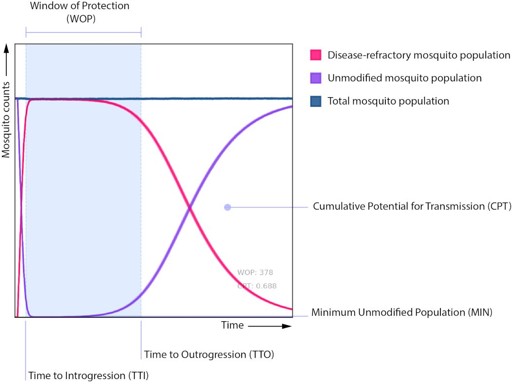
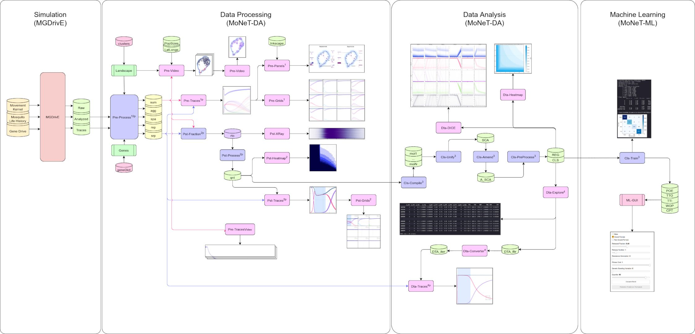

# Discovery Program: Mosquito Gene Drive Machine Learning Library

Our group has been generating datasets on the expected results on deploying genetically-modified mosquitoes over the last year. One of the challenges, however, is to share our results with collaborators and stakeholders. Installing and running our Mosquito Gene Drive Explorer (MGDrivE) model takes time and requires lots of computational resources; as such, we are working on generating surrogate machine learning models that are trained upon a set of summary statistics that describe the behavior of the system.

## Goals

1. To provide a report on the data exploration for the gene drive datasets provided.
   *  Correlation analysis
   *  Data distributions
   *  PCA
   *  Encoding
   *  Speedup DICE plots*
   *  Comparison between LDR/SDR
2. To train various version of regression and classification models for the datasets.
   * Check for overfits
   * Training/Validation
   * Auto-generate ML reports for the trained models (R-squared, confusion matrix, mean squared error, etc)
3. To create and upload a GUI with the models and predictions, so that other teams can explore the responses.
   * Check previous drafts by [Chris De Leon](https://mgdrive.herokuapp.com/) and [Elijah Bartolome](https://share.streamlit.io/elijahbartolome/monet_ml/main/STP/RBC/web_ui.py) show the basics of our endgoal (with rougher datasets and lighter explorations)
   * Explore alternatives and improve upon them

## Datasets Description

These datasets were generated as part of a larger publication on the effects of simulating the releases of CRISPR/Cas9 linked and split drive genetic modifications in the islands of São Tomé and Príncipe in equatorial Africa. In these versions of the dataset, we consider the landscape as a fully-mixing panmictic population to focus on the inherent properties of the drives, without the spatial component of the migration of the mosquitos.

 

### Inputs (Features)

* **i_sex** [1, 2, 3]: Sex-sorting of the released transgenic mosquitos [1]
  * **i_smx**: Male-only
  * **i_sxg**: Male and non-gravid females
  * **i_sxn**: Male and gravid females
* **i_ren** [0 _to_ 24]: Number of releases (weekly) [12]
  * _Number of weekly releases that take place._
* **i_res** [0 _to_ 1]: Release size (fraction of the total population) [0.5]
  * _Size of the weekly releases._
* **i_fch** [0 _to_ 1]: Fitness cost on the H alleles (homing) [0.175]
  * _Fitness cost on the presence of H alleles in mosquitos (fertility and mating)._
* **i_fcb** [0 _to_ 1]: Fitness cost on the B alleles (out-of-frame resistant) [0.117]
  * _Fitness cost on the presence of H alleles in mosquitos (fertility and mating)._
* **i_fcr** [0 _to_ 1]: Fitness cost on the R alleles (in-frame resistant) [0]
  * _Fitness cost on the presence of H alleles in mosquitos (fertility and mating)._
* **i_hrm** [0 _to_ 1]: Homing rate on males [1]
  * _Rate at which the drive correctly replaces a snip of the DNA in males (no R or B)._
* **i_hrf** [0 _to_ 1]: Homing rate on females [0.956]
  * _Rate at which the drive correctly replaces a snip of the DNA in females (no R or B)._
* **i_rsg** [0 _to_ 0.1185]: Resistance generation rate [0.079]
  * _Rate at which failed homing becomes R rather than B in the eggs laid by H mosquitos._
* **i_gsv** [0 _to_ 1e-2]: Genetic standing variation [1e-2]
  * _Inherent resistance (R) present in the population prior to the start of the releases of H mosquitos._
* **i_grp** [0]: Group (unused)
  * _Spatial aggregation group._
* **i_mig** [0]: Migration rate (unused)
  * _Migration rate in abstract landscapes._

### Outputs (Labels)

* **TTI**: Time to Introgression
* **TTO**: Time to Outrogression*
* **WOP**: Window of Protection
* **POE**: Probability of Elimination
* **POF**: Probability of Fixation*
* **CPT**: Cumulative Potential for Transmission
* **MNF**: Minimum Unmodified Population*

The summary statistics marked with '*' are not relevant for these datasets, or need fixing.

 

## Rules

* Document your work constantly!
* Push your work to the repo often!
* Document the reasons behind the decisions made.
* Write reasonable commit messages.
* Always think about what others will think when they read your code.
* Think about interpretability whenever making decisions on the models.
* Work on the designated folder of the repo (the one in which this README file is located at).
* Do not push datasets, images or models to the repo! (only code).
* Sync images, datasets, and models using google drive!
* Export your models as [joblib](https://joblib.readthedocs.io/en/latest/generated/joblib.dump.html) objects.
* You can use [Jupyter](https://jupyter.org/) code for development and exploration, but the end product must be a set pt **.py** files that can be called in series from the terminal (they will be run on a server).
* Functions definitions should have their own separate file(s).
* Have separate files for: data cleaning, training, testing, evaluation (pipelines).
* Have input/output paths as clearly stated variables that can be changed easily.
* Auto-generate ML reports for the trained models (R-squared, confusion matrix, etc).

 

## Team Roster

* Active: Lillian Weng, Joanna Yoo, Xingli Yu, Ayden Salazar
* Related Projects: [Elijah Bartolome](https://share.streamlit.io/elijahbartolome/monet_ml/main/STP/RBC/web_ui.py), [Christopher De Leon](https://mgdrive.herokuapp.com/)
* Lead: [Héctor M. Sánchez C.](https://chipdelmal.github.io/blog/)
