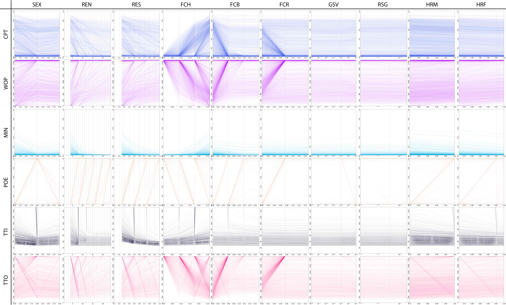

#   Linked drive in Saõ Tomé & Príncipe

This dataset contains around 1M factorial experiments for a replacement drive to be tested in the islands of Saõ Tomé & Príncipe. With this gene-drive we aim to modify the mosquito population so that mosquitos are refractory to disease transmission. The biological parameters and population sizes are set to resemble the ones found in the aforementioned geography, although we are using a fully-mixing population for computational reasons (one node).

## Goal and Variables Description

The objective of this workflow is to train independent classification and regression models for each one of the dependent variables, so that users can input values for the features and get an approximation of the behaviour we would expect from running the original MGDrivE simulation (which generated these datasets). These models should be exported to disk (as joblib objects), and we should be able to evaluate them on arbitrary features labels to test their performance. Reports of the training process and summary statistics should be provided too (confusion matrix, R-squared, features importance, etcetera).

### Independent (features)

* i_sex (categorical): Type of the releases
	* i_smx (1 bool): Male-only
	* i_sxg (2 bool): Male and non-gravid females
	* i_sxn (3 bool): Male and gravid females
* i_rsg (float linear): Resistance allele generation rate
* i_ren (int linear): Number of weekly releases
* i_res (float linear): Releases sizes (as a fraction of the total population)
* i_hrm (float linear): Homing rate on males
* i_hrf (float linear): Homing rate on females
* i_gsv (float log): Resistant alleles due to standing genetic variation
* i_fch (float linear): Fitness cost on the H allele
* i_fcb (float linear): Fitness cost on the B allele
* i_fcr (float linear): Fitness cost on the R allele
* i_mig (NA): Unused (it's always 0)
* i_grp (NA): Unused (it's always 0)

### Dependent (labels)

* CPT: Cumulative potential for transmission
* WOP: Window of protection
* TTI: Time to introgression
* POE: Probability of elimination (or fixation)
* MNF: Minimum fraction achieved
* POF: Unused
* TTO: Unused

## Datasets

* CLS_HLT_50Q_10T.csv: Classification dataset
* SCA_HLT_50Q_10T.csv: Regression dataset

 

