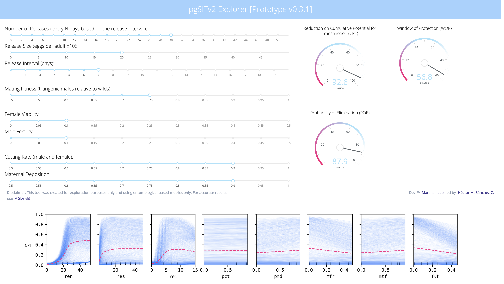

# pgSIT2



## Instructions to Run Locally

Download and install [docker](https://docs.docker.com/get-docker/), then pull our  image from [our dockerhub](https://hub.docker.com/repository/docker/chipdelmal/monet-pgs) with:

```bash
docker pull chipdelmal/monet-pgs:latest
```

To run the image, run the following command in the terminal on MacOS or Linux:

```bash
docker run -p 5000:5000 -v "$(pwd)"/app:/app --rm chipdelmal/monet-pgs:latest
```

or this one for Windows:

```bash
docker run -p 5000:5000 -v $pwd/app:/app --rm chipdelmal/monet-pgs:latest
```

Finally, open the following address on your favorite browser:

```bash
localhost:5000
```

## Sources

* https://github.com/yaojiach/docker-dash
* https://www.devcoons.com/how-to-deploy-your-plotly-dash-dashboard-using-docker/
* https://github.com/atheo89/dashboard-deployment
* https://samedwardes.com/2019/11/15/dash-heroku-cookie-cutter/
* https://github.com/SamEdwardes/dash-heroku-cookie-cutter

## Acknowledgments

Thanks to [Tomás León](https://tomasleon.com/) and [Jared Bennett](https://www.linkedin.com/in/jared-bennett-21a7a9a0) for their thorough feedback and help in brainstorming many of the ideas developed in this project. Also, special thanks to [Chris De Leon](https://www.linkedin.com/in/chris-de-leon-96bb361b5) and [Elijah Bartolome](https://www.linkedin.com/in/elijah-bartolome/) as parts of this project are based on their work as undergraduate students at the [Marshall lab](https://www.marshalllab.com/).

## Author

<br>

[Héctor M. Sánchez C.](chipdelmal.github.io)
